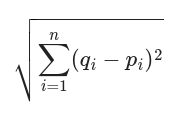

# k-means

1- K-means is a popular clustering algorithm used in machine learning to partition a dataset into K distinct, non-overlapping subsets or clusters based on their feature similarities.

2- The algorithm works by initializing K centroids randomly, then iteratively assigning each data point to the nearest centroid and updating the centroids to the mean of the assigned points until convergence.

3- K-means is computationally efficient and easy to implement, but it requires specifying the number of clusters in advance and can be sensitive to the initial placement of centroids.

## The Formula

I hope this useful for you.